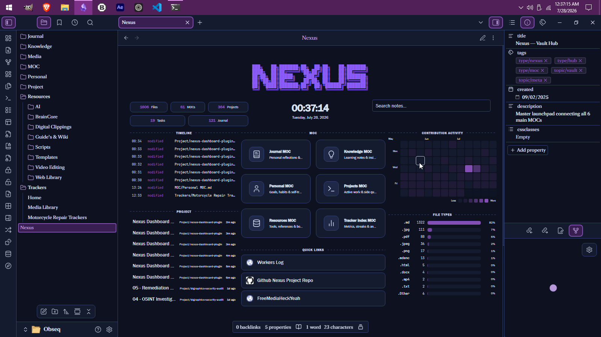
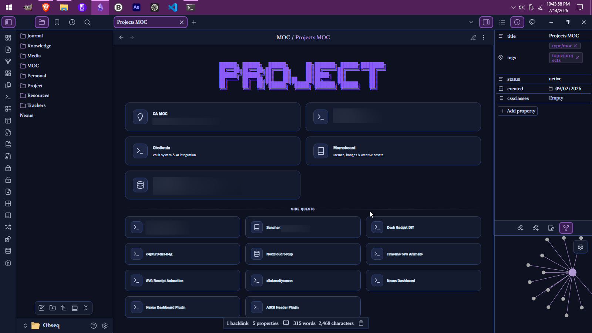
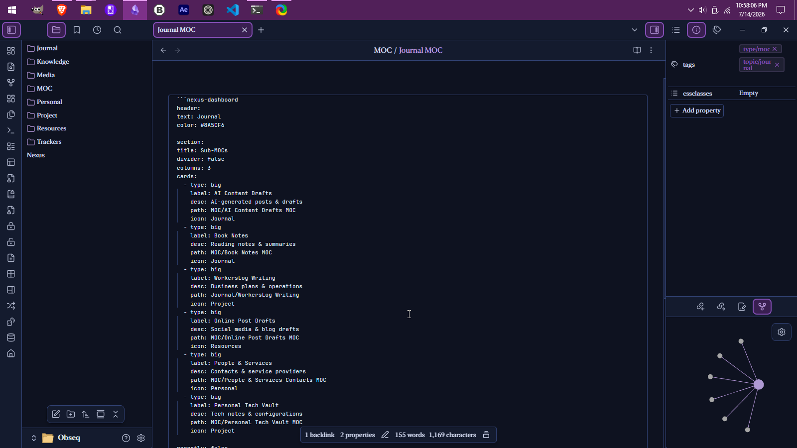
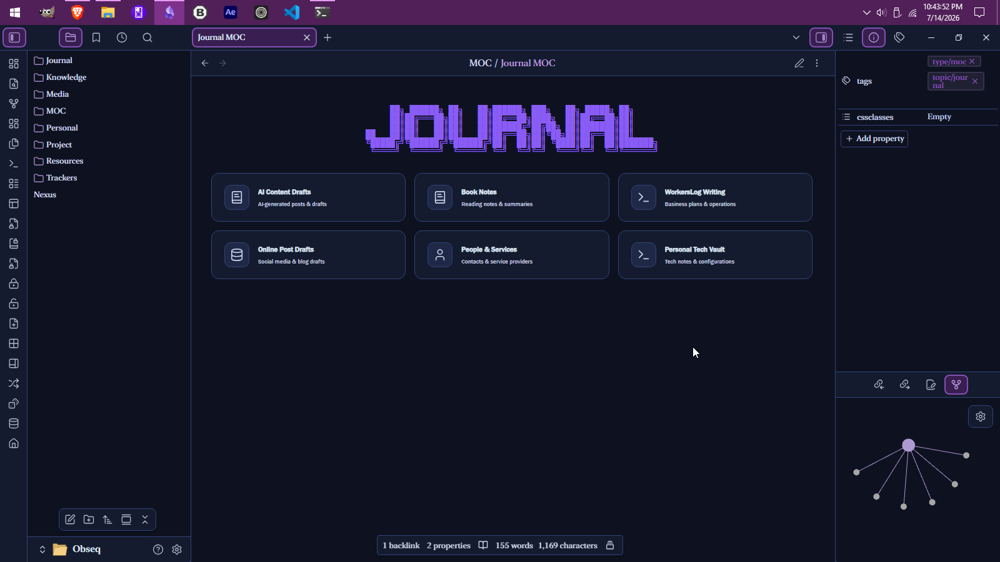

# Nexus Dashboard

Code-block driven MOC dashboard for Obsidian.

## Install

1. Download `main.js`, `manifest.json`, and `styles.css` from the [latest release](https://github.com/johnsstalk/nexus-dashboard-plugin/releases)
2. Create a folder `nexus-dashboard` in `.obsidian/plugins/`
3. Copy the three files into it
4. Enable the plugin in **Settings > Community Plugins**

## Quick Start

Create a note with a `nexus-dashboard` code block:

````
```nexus-dashboard
```
````

You can configure default settings in **Settings > Community Plugins > Nexus Dashboard**.



## Dashboard Components

### ASCII header
An ASCII art banner at the top of your dashboard.

Properties: `text`, `font`, `color`, `size`, `mobileSize`, `align`

````
```nexus-dashboard
header:
  text: MY VAULT
  font: ANSI Shadow
  color: #8A5CF6
  size: 1.0
  mobileSize: 0.5
  align: center
```
````

### Stats bar
Shows file/folder counts from selected folders.

Properties: `show` (true/false)

````
```nexus-dashboard
stats: true
```
````

### Section
A card grid area.

Properties: `columns` (1–4)

````
```nexus-dashboard
section:
  columns: 2
```
````

### Card
A navigation link inside a section.

Card entries start with `- type:` (big or mini). Each section must contain only one card type — the section picks a single grid (mini-grid or big-grid) based on the first card, mixing types forces all cards into the wrong layout.

Properties: `type` (big/mini), `label`, `desc`, `path`, `icon`, `color`, `columns` (1–4 on parent section)

Big cards:

````
```nexus-dashboard
section:
  columns: 2
  cards:
    - type: big
      label: Journal
      desc: Daily reflections
      path: MOC/Journal MOC.md
      icon: Journal
      color: #8A5CF6
```
````

Mini cards:

````
```nexus-dashboard
section:
  columns: 3
  cards:
    - type: mini
      label: Quick Link
      path: MOC/Book Notes MOC.md
      icon: Book
```
````







### Divider
A horizontal separator between sections.

Properties: `title`, `type` (default, bold, subtle, gradient, dashed)

````
```nexus-dashboard
divider:
  type: bold
  title: Archive
```
````

### Vault Activity
A compact terminal-style list of files, optionally filtered by path and/or tags. With no filter it shows the most recently modified notes from the whole vault.

Properties: `path`, `tags` (comma-separated), `count`, `label`, `show`

An empty `label` hides the divider header above the list. Slots without a list selected fall back to recently modified files from the whole vault, using the global **Label** and **Count** settings. In Settings → Components → Vault Activity, each named preset carries its own `path`, `tags`, `count`, and `label`; a preset with empty `path` and `tags` acts as a whole-vault list.

Multiple `vault-activity:` blocks with different filters each render their own list in their row/column.

````
```nexus-dashboard
vault-activity:
  label: Journal
  path: Journal/
  count: 10

vault-activity:
  label: Active Projects
  tags: project, active
  count: 5

vault-activity:
  count: 8
```
````

### Graph links
Injects wiki links at the bottom for visual navigation.

Properties: `showGraph`, `exclude` (comma-separated folder names)

````
```nexus-dashboard
graph:
  showGraph: true
  exclude: Templates,Attachments
```
````

### Search bar
A search input that filters vault notes.

Properties: `show` (true/false), `default` (vault/cards), `placeholder`

````
```nexus-dashboard
search:
  show: true
  default: vault
  placeholder: Search your vault...
```
````

### Links
A grid of clickable external or internal links.

Properties: `title`, `columns` (1–4)

Link items start with `- url:`. Each item can have `label`, `icon`, and `desc`.

````
```nexus-dashboard
links:
  title: Quick Links
  columns: 3
  items:
    - url: https://obsidian.md
      label: Obsidian
      icon: Link
    - url: https://github.com
      label: GitHub
      icon: GitHub
    - url: MOC/Journal MOC.md
      label: Journal
      icon: Journal
```
````

### Row
Places the next N sections side-by-side in columns. `row:` is a marker — the sections that follow it become the row's children.

Properties: `columns` (1–4, defaults to 2), `proportion`, `align` (top/center/stretch)

````
```nexus-dashboard
row:
  columns: 2
  proportion: 50/50
  - section:
      columns: 1
      cards:
        - type: big
          label: Left Panel
          path: MOC/Journal MOC.md
          icon: Journal
  - section:
      columns: 1
      cards:
        - type: big
          label: Right Panel
          path: MOC/Projects MOC.md
          icon: Project
```
````

### Column
Vertical stacking layout — places sections one above another inside a row.

Properties: `spacing`, `align` (top/center/stretch)

````
```nexus-dashboard
row:
  columns: 2
  - column:
      - section:
          columns: 1
          cards:
            - type: big
              label: Top Section
              path: MOC/Journal MOC.md
              icon: Journal
      - section:
          columns: 1
          cards:
            - type: mini
              label: Bottom Section
              path: MOC/Projects MOC.md
              icon: Project
  - section:
      columns: 1
      cards:
        - type: big
          label: Right Side
          path: MOC/Knowledge MOC.md
          icon: Knowledge
```
````

## Commands

Open **Ctrl+P** / **Cmd+P** and search:

- `Open dashboard` — opens the full dashboard view
- `Insert Nexus Dashboard code block` — inserts an empty code block
- `Insert ASCII art block` — inserts a header code block
- `Render selection as ASCII art` — wraps selected text in a header block

## Settings

Open **Settings > Community Plugins > Nexus Dashboard** to configure:

- **General** — open on startup, stats config (folder + label), export/import settings JSON, reset to defaults
- **Header** — ASCII text, font picker, color, desktop size, mobile size, alignment, live preview
- **Dashboard** — grid columns, MOC card editor (drag-and-drop reorder, collapsible sections), graph toggle
- **Components** — row/column layout editor, vault lists, quick links

## Development

```bash
npm install
npm run dev      # watch mode
npm run build    # production build
```

## License

[MIT](LICENSE)
